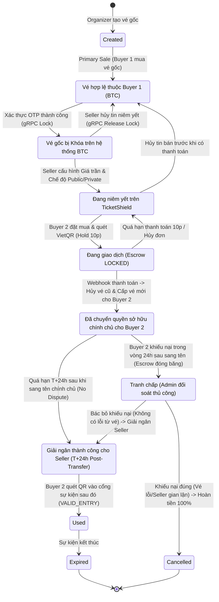
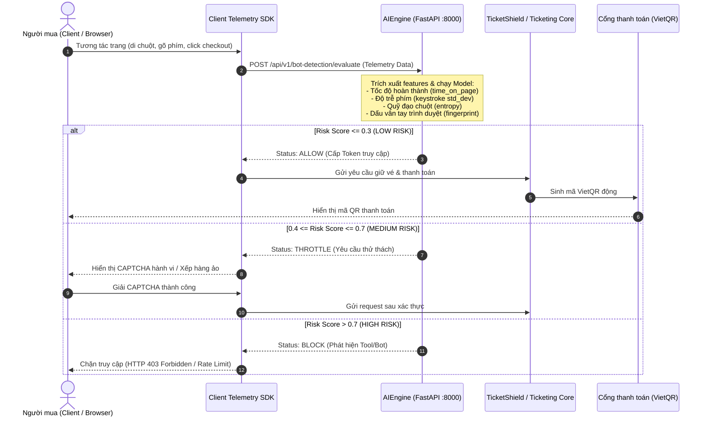
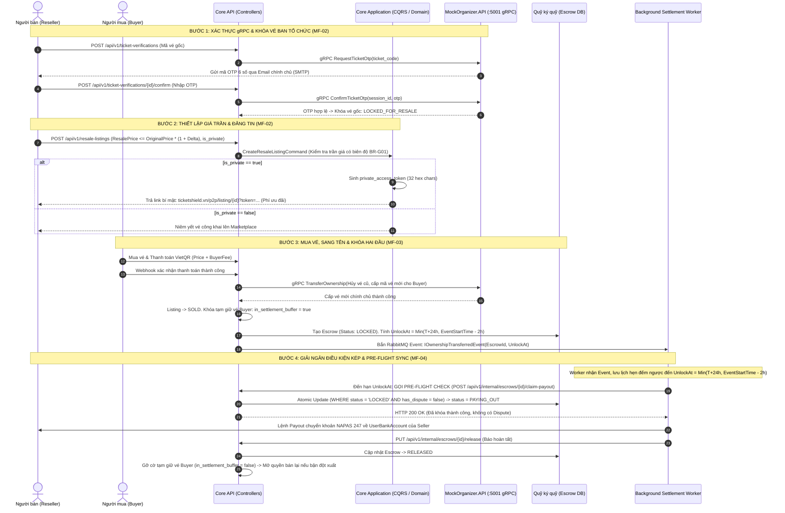
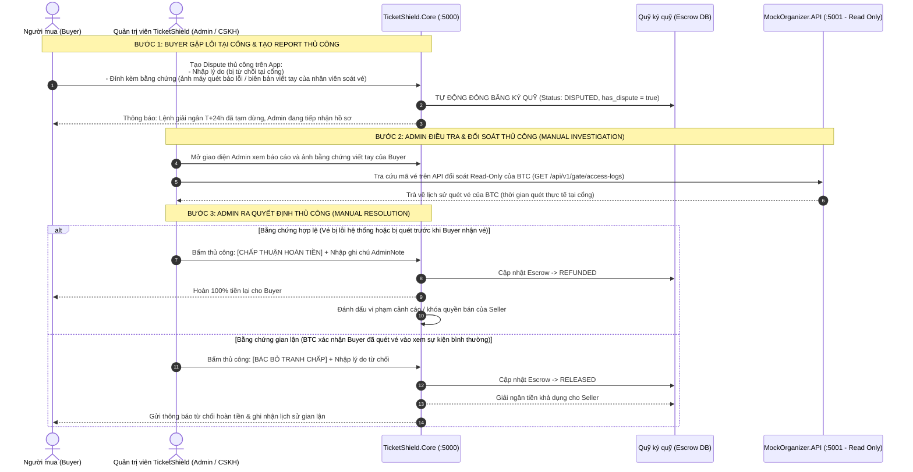

# TicketShield AI - 5 Mental Model Diagrams

Tài liệu thể hiện **5 sơ đồ bắt buộc** theo chuẩn Checklist nghiên cứu FA26SE261 bằng cú pháp Mermaid trực quan, phản ánh chính xác quy tắc nghiệp vụ và kiến trúc 3 services của dự án.

---

## Sơ đồ 1: Vòng Đời Của Vé (Ticket Lifecycle State Machine)

Mô tả toàn bộ các trạng thái mà một chiếc vé trải qua từ lúc Ban tổ chức phát hành, khóa niêm yết bán lại, chuyển giao và giải ngân:



---

## Sơ đồ 2: Luồng Mua Sơ Cấp & Phát Hiện Bot AI (Primary Purchase Flow & AI Bot Detection)

Minh họa cơ chế thu thập sinh trắc học hành vi client và đánh giá rủi ro (Risk Scoring) phân loại 3 mức Allow / Throttle / Block:



---

## Sơ đồ 3: Luồng Chuyển Nhượng P2P & Ký Quỹ Escrow (P2P Resale & Escrow Flow)

Thể hiện quy trình: **gRPC Verification -> Configurable Markup -> Dual-Hold (Tiền & Vé) -> Transfer Ownership -> Dual-Condition Payout**:




---

## Sơ đồ 4: Luồng Xử Lý Khiếu Nại & Đối Soát Thủ Công (Manual Dispute Management Flow)

Xử lý sự cố khi Buyer gặp trục trặc tại cửa soát vé sự kiện. Quá trình này **100% do Admin/CSKH xử lý thủ công (Manual Review)**, TicketShield là trung gian không can thiệp vào hệ thống soát vé của Ban tổ chức:



---

## Sơ đồ 5: Kiến Trúc Hệ Thống Tổng Thể (System Architecture & Topology)

Minh họa 3 services độc lập, các cơ sở dữ liệu riêng biệt và tích hợp ngoại vi:

```mermaid
flowchart TB
    subgraph ClientLayer ["Lớp Khách Hàng (Client Layer)"]
        WebUI["TicketShield Web App (Next.js / Vanilla TS)"]
        MobileSDK["Client Telemetry SDK (Mouse / Keystroke / Fingerprint)"]
    end

    subgraph CoreService ["TicketShield.Core (.NET 8 Web API :5000)"]
        API_GW["API Gateway / Controllers"]
        subgraph CleanArch ["Clean Architecture"]
            AppCQRS["Application (CQRS / MediatR / FluentValidation)"]
            DomainLogic["Domain (Entities / Value Objects / Global Business Laws)"]
            InfraPersist["Infrastructure (EF Core Fluent API / Polly Retry)"]
        end
        BgWorker["Background Worker (Escrow T+24h Settlement)"]
    end

    subgraph AIService ["AIEngine Service (Python FastAPI :8000)"]
        FastAPI_App["FastAPI Server"]
        ML_Model["ML Inference Engine (Random Forest / XGBoost)"]
    end

    subgraph MockOrganizerService ["MockOrganizer.API (.NET 8 Web API :5001)"]
        OrgControllers["Organizer Partner API"]
        TicketLifecycleMgr["Ticket Issue / Cancel / Transfer Engine"]
        GateSimulator["Gate Access & Barcode Scanner Simulator"]
    end

    subgraph DataStorage ["Lớp Dữ Liệu & Hạ Tầng (PostgreSQL Cluster)"]
        CoreDB[("ticketshield_db<br/>- resale_listings<br/>- escrow_transactions<br/>- payout_transactions<br/>- user_bank_accounts<br/>- disputes")]
        OrgDB[("organizer_db<br/>- mock_tickets<br/>- mock_otps<br/>- gate_access_logs")]
    end

    subgraph ExternalIntegrations ["Dịch Vụ Tích Hợp Ngoại Vi"]
        VietQR["Cổng Thanh Toán VietQR / NAPAS 247"]
        SMTP["Hệ Thống Gửi Email OTP (SMTP Server)"]
    end

    %% Interactions
    WebUI -->|REST API / JWT| API_GW
    MobileSDK -->|Telemetry Payload| FastAPI_App
    FastAPI_App --> ML_Model
    ML_Model -->|Risk Score & Outcome| API_GW

    API_GW --> AppCQRS
    AppCQRS --> DomainLogic
    AppCQRS --> InfraPersist
    InfraPersist -->|Npgsql / EF Core| CoreDB
    BgWorker -->|Scan Locked Escrows & Payouts| CoreDB

    InfraPersist -->|gRPC Contract (organizer_resale.proto)| OrgControllers
    OrgControllers --> TicketLifecycleMgr
    TicketLifecycleMgr -->|Npgsql| OrgDB
    GateSimulator -->|Log Scans| OrgDB


    InfraPersist -->|Generate Dynamic QR| VietQR
    OrgControllers -->|Send OTP Code| SMTP
```
