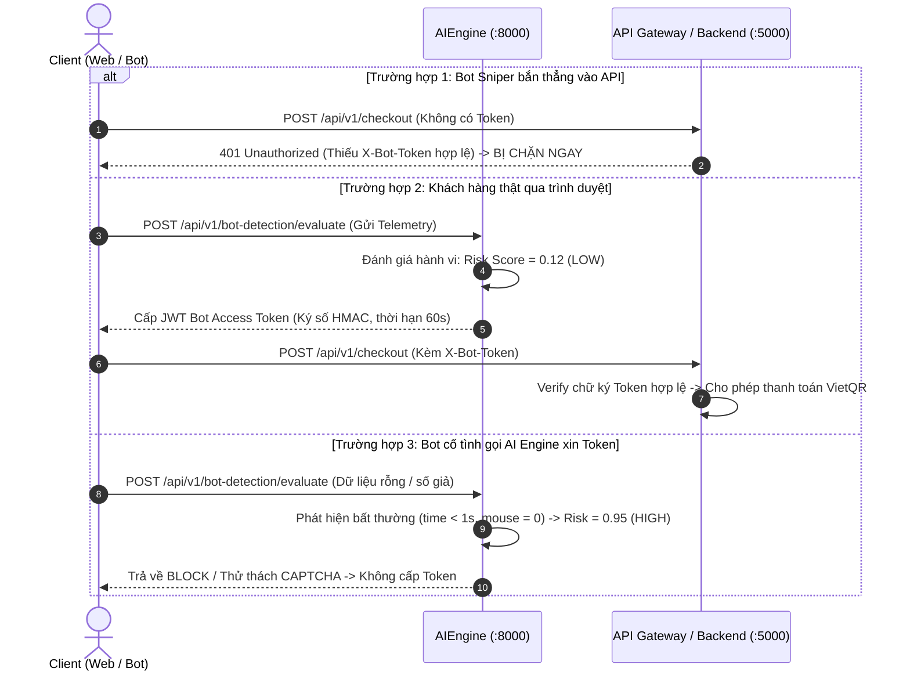

# TicketShield AI - AI Bot Detection Research Summary

Tài liệu tóm tắt nghiên cứu về **AI Bot Detection** được biên soạn riêng cho sinh viên ngành **Kỹ thuật Phần mềm (Software Engineering - SE)**, cập nhật theo chuẩn đề bài chính thức Capstone FA26SE261 (GVHD: Thân Thị Ngọc Vân), giúp bạn hiểu sâu bản chất, tự tin thuyết trình và phản biện đồ án tốt nghiệp trước Hội đồng.

---

## 1. Bản Chất Bài Toán: Phân Biệt Human vs Automated Bot

Trong các sự kiện "cháy vé" (như Concert Anh Trai Vượt Ngàn Chông Gai, Born Pink, Taylor Swift), phe vé sử dụng các công cụ tự động (Puppeteer, Selenium, Custom Python/Go API scripts) để gửi hàng ngàn request mua vé chỉ trong vài trăm mili-giây.

Con người thật có những giới hạn sinh học tự nhiên không thể sao chép hoàn hảo:
- Cần thời gian đọc thông tin trên màn hình (thường > 5 giây).
- Chuột di chuyển theo quỹ đạo cong ngẫu nhiên (đường cong Bézier), có gia tốc, có điểm dừng.
- Gõ phím có độ trễ không đều giữa các phím (độ lệch chuẩn thời gian gõ phím cao).

Trong khi đó, bot tự động:
- Điền form và bấm checkout chỉ trong 0.2 - 1.5 giây.
- Chuột đứng yên (0 chuyển động) hoặc nhảy thẳng tắp tới tọa độ nút bấm (entropy gần bằng 0).
- Nhịp gõ phím đều tăm tắp như máy (độ lệch chuẩn gần bằng 0).
- Trình duyệt chạy ở chế độ ngầm (`navigator.webdriver = true` trong headless browser) hoặc bỏ qua hẳn trình duyệt để bắn raw HTTP POST thẳng vào server.

---

## 2. Feature Engineering (Kỹ Thuật Trích Xuất Đặc Trưng)

Hệ thống Client-side Telemetry SDK thu thập 6 chỉ số hành vi cốt lõi gửi về AIEngine:

| Feature Name | Kiểu | Ý nghĩa và Quy luật nhận diện |
| :--- | :--- | :--- |
| `time_on_page_seconds` | Float | Thời gian từ lúc mở trang đến khi submit. Con người: 8s - 30s. Bot: < 2s. |
| `mouse_movement_count` | Int | Số lượng sự kiện `mousemove`. Con người: > 20 lần. Bot desktop: = 0 hoặc < 3. |
| `mouse_curvature_entropy` | Float | Độ phân tán/phức tạp của góc di chuột. Con người: > 2.0 (cong tự nhiên). Bot: < 0.5 (đường thẳng tuyệt đối). |
| `keystroke_intervals_std_dev_ms` | Float | Độ lệch chuẩn giữa các lần nhấn phím. Con người: 30ms - 60ms (bất quy tắc). Bot: < 5ms (nhịp điệu máy tính). |
| `requests_per_second` | Float | Tần suất request từ một session/IP. Con người: 0.1 - 1.5 req/s. Bot: > 5.0 req/s. |
| `is_headless_browser` | Boolean | Trạng thái phát hiện WebDriver/Puppeteer qua kiểm tra Canvas/WebGL. |

---

## 3. So Sánh Các Phương Pháp AI/ML

| Tiêu chí | Rule-Based (Luật tĩnh) | Supervised ML (Random Forest / XGBoost) | Deep Learning / Anomaly Detection |
| :--- | :--- | :--- | :--- |
| **Độ trễ suy luận** | Cực nhanh (< 2ms) | **Rất nhanh (10ms - 30ms)** - Phù hợp API | Chậm (> 100ms), cần GPU |
| **Khả năng thích ứng** | Kém (Bot đổi kịch bản là qua mặt được) | **Tốt (Bắt được mối tương quan phi tuyến tính)** | Tốt |
| **Độ phức tạp triển khai** | Đơn giản | **Vừa phải, dễ tích hợp với FastAPI / Scikit-Learn** | Rất phức tạp, khó giải thích |
| **Tính minh bạch (Explainability)** | Cao | **Rất cao (có Feature Importance và Decision Path)** | Kém (Black-box) |

### Kết luận lựa chọn cho TicketShield:
> Đồ án sử dụng mô hình **Random Forest Classifier** kết hợp bộ lọc luật cứng ban đầu (Rule-based heuristics). Lựa chọn này đảm bảo độ trễ siêu thấp (< 30ms) không làm nghẽn luồng checkout, giải thích được lý do chặn vé cho người dùng và hoàn toàn khả thi trong đồ án tốt nghiệp của sinh viên Kỹ thuật phần mềm.

---

## 4. Cơ Chế Chấm Điểm Rủi Ro (Risk Scoring Thresholds)

Mô hình không chỉ phân loại nhị phân 0/1 (Bot hay Người), mà trả về xác suất rủi ro `risk_score` từ 0.0 đến 1.0 chia thành 3 ngưỡng hành động:

```
Risk Score:
0.0 ──────────────── 0.3 ──────────────── 0.7 ──────────────── 1.0
      [ LOW RISK ]             [ MEDIUM RISK ]           [ HIGH RISK ]
         ALLOW                    THROTTLE                  BLOCK
   (Cho phép thanh toán)    (Bắt giải Captcha)       (Chặn dứt điểm)
```

1. **LOW RISK ($\le 0.3$):** Người dùng bình thường, thao tác tự nhiên. Hệ thống cấp Access Token cho phép tạo đơn và lấy mã VietQR ngay.
2. **MEDIUM RISK ($0.4 - 0.7$):** Có dấu hiệu bất thường (ví dụ: thao tác rất nhanh hoặc ít di chuột). Hệ thống không chặn ngay mà yêu cầu xác thực CAPTCHA hành vi để loại trừ trường hợp con người thao tác nhanh (tránh False Positive).
3. **HIGH RISK ($> 0.7$):** Phát hiện headless browser, request dồn dập, gõ phím tự động. Hệ thống chặn đứng (HTTP 403) và khóa IP tạm thời.

---

## 5. Dữ Liệu Huấn Luyện (Synthetic Dataset)

Do các tập dữ liệu hành vi bot mua vé thực tế thường là tài sản bảo mật độc quyền của các công ty lớn (Cloudflare, Ticketmaster), đồ án sử dụng **Synthetic Data Generation** (Sinh dữ liệu giả lập có cơ sở khoa học dựa trên phân phối xác suất Poisson, Gamma và Normal).

Script đã được cài đặt sẵn tại:
`d:\Capstone\src\AIEngine\app\synthetic_data_generator.py`

Khi chạy script này, hệ thống sẽ:
1. Sinh 5.000 bản ghi dữ liệu hành vi (70% Human, 30% Bot).
2. Huấn luyện mô hình Random Forest trên Scikit-Learn.
3. Xuất báo cáo đánh giá (Accuracy > 98%, ROC-AUC > 0.99) và bảng trọng số các đặc trưng quan trọng nhất (Feature Importances).

---

## 6. Threat Modeling: Các Chiêu Thức Tấn Công Thực Tế Của Phe Vé

Trong thực tế, các cuộc tấn công không chỉ đơn thuần là mở trình duyệt Chrome rồi bấm nút tự động. Thế giới phe vé ngầm sử dụng các kỹ thuật tinh vi sau:

### 6.1. API Sniping (Bypass Client hoàn toàn)
- **Cơ chế:** Bot bỏ qua hoàn toàn giao diện Frontend (không tải HTML/CSS/JS nặng nề). Khi đến giờ mở bán, script viết bằng Go/Rust bắn trực tiếp gói tin JSON 500 bytes thẳng vào endpoint `POST /checkout`.
- **Lý do web lag mà bot vẫn gom được vé:** Người dùng thật bị nghẽn mạng do tải hàng chục MB hình ảnh, sơ đồ ghế, trong khi bot chỉ gửi request API siêu nhẹ qua mạng Proxy xoay (Residential Proxies).

### 6.2. Giữ Giỏ Hàng Ảo (Denial of Inventory / Cart Hoarding)
- **Cơ chế:** Bot mở hàng trăm session ảo, đưa toàn bộ vé VIP vào giỏ hàng để giữ chỗ trong 10 phút mà không thanh toán.
- **Mục đích:** Tạo ra tình trạng "cháy vé ảo" trên hệ thống, ép khán giả phải ra chợ đen mua với giá thổi phồng. Nếu bán được trên Facebook, bot mới thực sự thanh toán; nếu không bán được, bot nhả giỏ hàng ra.

### 6.3. Săn Vé Chợ Thứ Cấp Tức Thì (Resale Front-Running / Sniping)
- **Cơ chế:** Bot cắm polling liên tục vào API niêm yết vé P2P (`GET /api/v1/resale/listings`). Vì sàn có luật trần giá ($ResalePrice \le OriginalPrice$), hễ có khán giả đăng bán lại vé giá rẻ là bot lập tức quét mua trong 0.05 giây để mang ra ngoài chợ đen bán chênh lệch.

### 6.4. Đánh Cắp Tài Khoản Hàng Loạt (Credential Stuffing / ATO)
- **Cơ chế:** Sử dụng kho dữ liệu tài khoản bị lộ lọt trên Internet để quét tự động nhằm chiếm đoạt tài khoản đã liên kết thẻ ngân hàng hoặc có quyền ưu tiên mua vé sớm.

### 6.5. Khiếu Nại Gian Lận (Fake Dispute / Friendly Fraud)
- **Cơ chế:** Buyer mua vé trên sàn P2P, vào xem ca nhạc bình thường nhưng sau đó vẫn mở Dispute tố cáo "vé không hợp lệ tại cổng" nhằm đòi hoàn lại 100% tiền Escrow.

---

## 7. Ranh Giới Hệ Thống & Cơ Chế "Cửa Ải Token" (Token Gatekeeper Pattern)

Để ngăn chặn việc bot bỏ qua Client và bắn thẳng vào API, hệ thống triển khai cơ chế **Token Gatekeeper**:



### Ranh giới triển khai giữa 2 Module trong Proposal FA26SE261:

1. **Phía Sơ Cấp (Primary Sale - Tích hợp bên BTC):**
   - TicketShield cung cấp **Embeddable Client SDK** (nhúng vào trang mua vé của BTC) và **Verification Middleware** cho BTC.
   - Nhờ đó, BTC không cần viết lại toàn bộ hệ thống bán vé, mà chỉ cần nhúng lớp bảo vệ của TicketShield. Trong đồ án, `MockOrganizer.API` đóng vai trò giả lập hệ thống bán vé gốc đã nhúng SDK này.
2. **Phía Thứ Cấp (Secondary Resale - Sàn P2P TicketShield):**
   - TicketShield làm chủ 100% hệ thống sàn P2P. Module AI Bot Detection này được **tái sử dụng trực tiếp** trên cổng checkout của sàn P2P để chống lại nạn Resale Sniping (bot vét vé giá rẻ), đảm bảo quyền lợi cho người hâm mộ chân chính!
